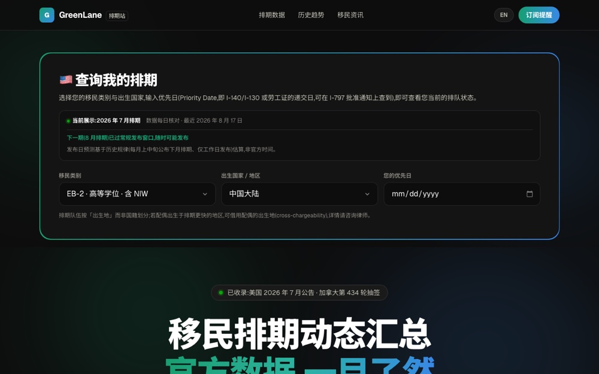

# GreenLane — Immigration Timeline Tracker

**▶ [Open the site](https://greenlane-beryl.vercel.app)**

A dashboard for immigration backlogs. US green card categories (EB-1 through EB-5, NIW and
family-based) sit alongside Canada's Express Entry draws, with ten years of history, wait
estimates per category, official regulatory news, and email alerts when a cutoff date
moves. Panels for the UK, Australia and New Zealand are built; their data sources are being
wired up.

Every figure comes from an official source. **This is not legal advice.**



*The dashboard — current cutoff dates and ten years of movement*

## Quick start

```bash
npm install
npm run dev        # http://localhost:3000
```

## Data pipelines

Three of them, all running on free infrastructure:

```bash
python3 scripts/scrape_bulletins.py   # US visa bulletins (incremental; --full re-fetches from 2015-10)
python3 scripts/fetch_canada.py       # Canada Express Entry draws (headless Chrome, works around Akamai)
python3 scripts/fetch_news.py         # US Federal Register immigration rules (official free API)
```

Output lands in `src/data/`: `bulletins.json` (130 US bulletins), `canada.json` (424 draws),
`live-news.json` (10 regulatory updates).

**Automatic updates:** `.github/workflows/update-data.yml` runs daily at 10:00 UTC, fetches
everything and commits any changes. Free on public repositories. One caveat — IRCC's Akamai
protection sometimes blocks data-centre IPs, so if the Canadian job fails on Actions, run
that script locally.

## Structure

| Path | Role |
|---|---|
| `scripts/` | The three ingestion pipelines above |
| `src/lib/bulletin.ts` | US timeline maths — advances and retrogressions, trend series, average pace, wait estimates |
| `src/lib/canada.ts` | Canadian draw categories and helpers |

Built with Next.js 15 and TypeScript; server-rendered so the numbers are fresh on first
paint.

---

© 2026 Weiren Feng. All rights reserved. Published for reading and portfolio purposes; not
licensed for reuse, modification, or redistribution.
