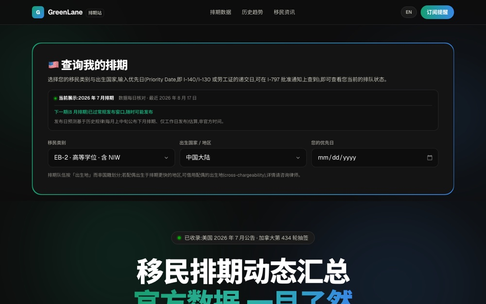

# GreenLane — Immigration Timeline Tracker

**▶ [Open the site](https://greenlane-beryl.vercel.app)**

A dashboard for immigration backlogs. US green card categories (EB-1 through EB-5, NIW and
family-based) sit alongside Canada's Express Entry draws, with ten years of history, wait
estimates per category and official regulatory news. Email alerts for when a cutoff date
moves are coming soon — the panel is in place, but no address is collected yet. Panels for
the UK, Australia and New Zealand are built; their data sources are being wired up.

Every figure comes from an official source. **This is not legal advice.**



*The dashboard — current cutoff dates and ten years of movement*

## Quick start

```bash
npm install
npm run dev        # http://localhost:3000
```

## Data pipelines

Three of them:

```bash
python3 -m pip install -r scripts/requirements.txt
python3 scripts/scrape_bulletins.py   # US bulletins: backfill + recheck current/latest; --full rechecks all
python3 scripts/fetch_canada.py       # Canada Express Entry draws (headless Chrome, works around Akamai)
python3 scripts/fetch_news.py         # US Federal Register immigration rules (official free API)
```

Output lands in `src/data/`: `bulletins.json` (133 US bulletins through October 2026), `canada.json`,
`live-news.json` (10 regulatory updates).

**Automatic updates:** `.github/workflows/update-data.yml` runs at 04:17, 10:17, 16:17 and
22:17 UTC, fetches everything and commits validated changes. GitHub may delay scheduled runs.
The US pipeline discovers published months from the official directory and rechecks the
current/latest bulletin for revisions. HTTP failures fall back to a separate Chrome session
using Playwright; install Google Chrome locally, or use the Chrome bundled on GitHub's runner.
Actions uses `xvfb-run` with `--headed` to allow the page to finish loading.
If the official site still blocks access, or a published table is incomplete, the job fails
and preserves the previous data **and its last-successful-check date**. A failed request is
never treated as evidence that no bulletin was published. The validator also rejects a latest
bulletin older than the current month.

Run regression checks with `python3 -m unittest discover -s scripts/tests -v` and
`node scripts/validate_data.mjs`. The August–October 2026 fixtures contain normalized official
table text retrieved on September 29, 2026; they document the one-time backfill and exercise
the parser. Scheduled updates never use these snapshots as a live-data fallback.

One caveat — IRCC's Akamai
protection sometimes blocks data-centre IPs, so if the Canadian job fails on Actions, run
that script locally.

## Structure

| Path | Role |
|---|---|
| `scripts/` | The three ingestion pipelines above |
| `src/lib/bulletin.ts` | US timeline maths — advances and retrogressions, trend series, average pace, wait estimates |
| `src/lib/canada.ts` | Canadian draw categories and helpers |

Built with Next.js 15 and TypeScript, server-rendered.

---

© 2026 Weiren Feng. All rights reserved. Published for reading and portfolio purposes; not
licensed for reuse, modification, or redistribution.
